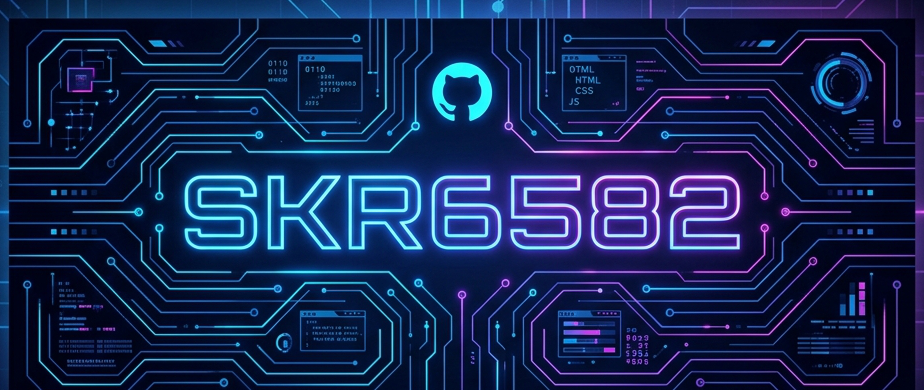

  

<!-- 1. About Me Card -->
<picture>
  <source media="(prefers-color-scheme: dark)" srcset="cards/about_me.svg" />
  <source media="(prefers-color-scheme: light)" srcset="cards/about_me_light.svg" />
  
</picture>

  

<!-- 2. Tech Stack Card -->
<picture>
  <source media="(prefers-color-scheme: dark)" srcset="cards/tech_stack.svg" />
  <source media="(prefers-color-scheme: light)" srcset="cards/tech_stack_light.svg" />
  
</picture>

  

<!-- 3. Featured Projects Card -->
<picture>
  <source media="(prefers-color-scheme: dark)" srcset="cards/projects.svg" />
  <source media="(prefers-color-scheme: light)" srcset="cards/projects_light.svg" />
  
</picture>

<b>📂 Quick Links to Repositories</b>

 

| Category | Repository | Description |
|:---------|:-----------|:------------|
| 🤖 AI | [DiscordBot-Iro](https://github.com/SKR6582/DiscordBot-Iro) | Advanced Korean conversational AI chatbot |
| 🤖 AI | [Hana-Intelligence](https://github.com/SKR6582/Hana-Intelligence) | Multi-functional AI chatbot |
| 🤖 AI | [V_friend](https://github.com/SKR6582/V_friend) | Interactive AI virtual companion |
| 🤖 AI | [Persona_Diary](https://github.com/SKR6582/Persona_Diary) | AI-driven emotional diary calendar |
| 🤖 AI | [AI_FM](https://github.com/SKR6582/AI_FM) | Automated AI radio |
| 🛡️ Security | [discord_protect](https://github.com/SKR6582/discord_protect) | Discord server security bot |
| 🛡️ Security | [Orbit](https://github.com/SKR6582/Orbit) | Server backup & recovery bot |
| 🛡️ Security | [Vanguard](https://github.com/SKR6582/Vanguard) | Discord moderation system |
| 📱 Apps | [ska_manager](https://github.com/SKR6582/ska_manager) | Study room booking system |
| 📱 Apps | [Classroom_tv-V2](https://github.com/SKR6582/Classroom_tv-V2) | School digital display platform |
| 📱 Apps | [LingoLens](https://github.com/SKR6582/LingoLens) | macOS real-time OCR translator |
| ⚙️ Utils | [keychain_cli](https://github.com/SKR6582/keychain_cli) | Security threat scanner |
| ⚙️ Utils | [mass-produced-shorts-skipper](https://github.com/SKR6582/mass-produced-shorts-skipper) | Auto-skipping browser extension |
| ⚙️ Utils | [Yochiyochi](https://github.com/SKR6582/Yochiyochi) | Experimental playground |

<!-- 4. Activity Dashboard Card -->
<picture>
  <source media="(prefers-color-scheme: dark)" srcset="cards/dashboard.svg" />
  <source media="(prefers-color-scheme: light)" srcset="cards/dashboard_light.svg" />
  
</picture>

  <picture>
    <source media="(prefers-color-scheme: dark)" srcset="https://github-readme-stats.vercel.app/api?username=SKR6582&show_icons=true&include_all_commits=true&count_private=true&bg_color=1a1b26&hide_border=true&title_color=70a5fd&icon_color=ff007c&text_color=a9b1d6" />
    <source media="(prefers-color-scheme: light)" srcset="https://github-readme-stats.vercel.app/api?username=SKR6582&show_icons=true&include_all_commits=true&count_private=true&bg_color=f6f8fa&hide_border=true&title_color=0969da&icon_color=ff5f56&text_color=24292f" />
    
  </picture>
  <picture>
    <source media="(prefers-color-scheme: dark)" srcset="https://github-readme-stats.vercel.app/api/top-langs/?username=SKR6582&layout=compact&bg_color=1a1b26&hide_border=true&title_color=70a5fd&icon_color=ff007c&text_color=a9b1d6" />
    <source media="(prefers-color-scheme: light)" srcset="https://github-readme-stats.vercel.app/api/top-langs/?username=SKR6582&layout=compact&bg_color=f6f8fa&hide_border=true&title_color=0969da&icon_color=ff5f56&text_color=24292f" />
    
  </picture>

  

 

  <i>Refined with ✨ by <b>Antigravity</b></i>

